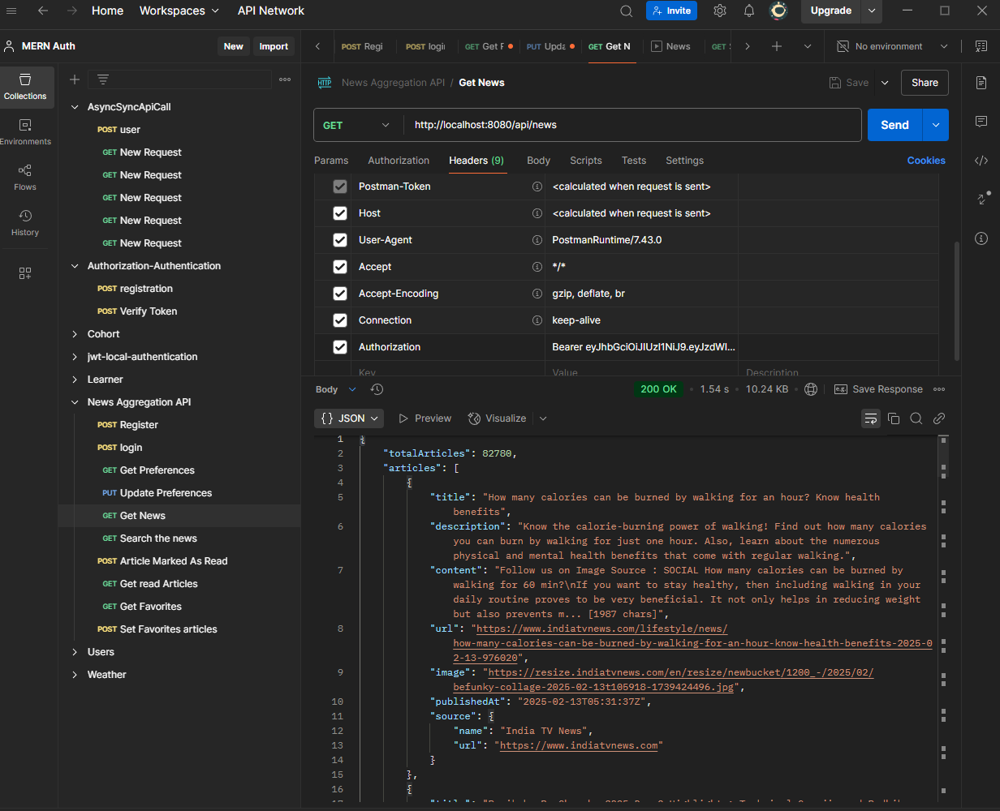
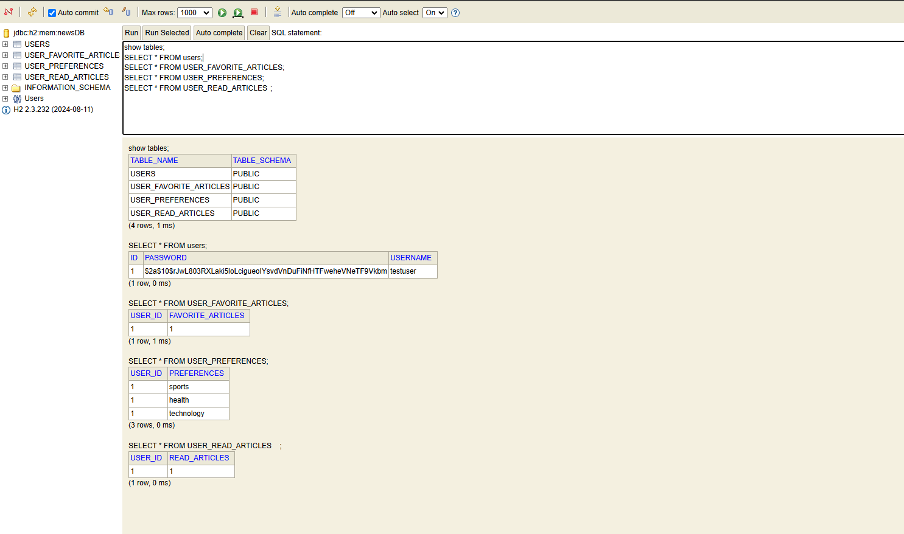

# News Aggregator API
===================

The **News Aggregator API** is a Spring Boot-based application that allows users to register, log in, and fetch personalized news articles based on their preferences. It uses **JWT (JSON Web Tokens)** for authentication and integrates with external news APIs to fetch news articles.

* * * * *

Features
--------

-   **User Authentication**:

    -   Register a new user.

    -   Log in with a username and password to receive a JWT token.

-   **News Preferences**:

    -   Retrieve the logged-in user's news preferences.

    -   Update the logged-in user's news preferences.

-   **News Fetching**:

    -   Fetch news articles based on the user's preferences.

-   **External API Integration**:

    -   Integrates with external news APIs (e.g., NewsAPI, GNews) to fetch news articles.

-   **Error Handling**:

    -   Proper exception handling for invalid requests, authentication errors, and authorization errors.

-   **Input Validation**:

    -   Validates user registration and news preference updates using Spring's validation annotations.

* * * * *

Technologies Used
-----------------

-   **Spring Boot**: Backend framework.

-   **Spring Security**: Authentication and authorization.

-   **JWT (JSON Web Tokens)**: Token-based authentication.

-   **H2 Database**: In-memory database for storing user information and preferences.

-   **WebClient**: For making asynchronous HTTP requests to external APIs.

-   **Maven**: Dependency management.

-   **Postman**: API testing.

* * * * *

Setup Instructions
------------------

### Prerequisites

-   **Java 22**.

-   **Maven** (for dependency management).

-   **Postman** (for testing the API).

* * * * *

### Step 1: Clone the Repository

```bash
git clone https://github.com/your-username/news-aggregator-api.git
cd news-aggregator-api
```

* * * * *

### Step 2: Configure the Application

1.  **External API Key**:

    -   Sign up for an API key from a news provider (e.g., [NewsAPI](https://newsapi.org/), [GNews](https://gnews.io/), or [NewsCatcher](https://newscatcherapi.com/)).

    -   Update the `apiKey` variable in the `ExternalNewsApiClient` class with your API key.

2.  **Database Configuration**:

    -   The application uses an **H2 in-memory database** by default.

    -   You can access the H2 console at `http://localhost:8080/h2-console`.

        -   **JDBC URL**: `jdbc:h2:mem:newsDB`

        -   **Username**: `sa`

        -   **Password**: `password`

* * * * *

### Step 3: Build and Run the Application

1.  **Build the Application**:

   ```bash

    mvn clean install
  ```

2.  **Run the Application**:

    ```bash
    mvn spring-boot:run
    ```
    
3.  **Access the Application**:

    -   The application will be running at `http://localhost:8080`.

* * * * *

API Documentation
-----------------

### Base URL

 ```bash
http://localhost:8080
```
* * * * *

### Endpoints

#### 1\. **Register a New User**

-   **URL**: `/api/register`

-   **Method**: `POST`

-   **Request Body**:

     ```json
    {
        "username": "testuser",
        "password": "testpassword"
    }
    ```
-   **Response**:

   ```json
    {
        "message": "User registered successfully"
    }
  ```
* * * * *

#### 2\. **Log in a User**

-   **URL**: `/api/login`

-   **Method**: `POST`

-   **Request Body**:

  ```json
    {
        "username": "testuser",
        "password": "testpassword"
    }
  ```
-   **Response**:

```json
    {
        "token": "eyJhbGciOiJIUzI1NiJ9..."
    }
```
* * * * *

#### 3\. **Get User Preferences**

-   **URL**: `/api/preferences`

-   **Method**: `GET`

-   **Headers**:

    -   `Authorization: Bearer <token>`

-   **Response**:

    ```json
    ["sports", "technology"]
    ```
* * * * *

#### 4\. **Update User Preferences**

-   **URL**: `/api/preferences`

-   **Method**: `PUT`

-   **Headers**:

    -   `Authorization: Bearer <token>`

-   **Request Body**:

   ```json
    ["sports", "technology", "health"]
  ```
-   **Response**:

  ```json
    "Preferences updated successfully"
  ```
* * * * *

#### 5\. **Fetch News Articles**

-   **URL**: `/api/news`

-   **Method**: `GET`

-   **Headers**:

    -   `Authorization: Bearer <token>`

-   **Response**:

  ```json
    {
        "status": "ok",
        "articles": [
            {
                "title": "News Title 1",
                "description": "News Description 1",
                "source": "News Source 1"
            },
            {
                "title": "News Title 2",
                "description": "News Description 2",
                "source": "News Source 2"
            }
        ]
    }
```



* * * * *

Testing the API
---------------

1.  **Register a User**:

    -   Use the `/api/register` endpoint to create a new user.

2.  **Log in**:

    -   Use the `/api/login` endpoint to log in and get a JWT token.

3.  **Fetch News**:

    -   Use the `/api/news` endpoint with the JWT token to fetch news articles.

4.  **Update Preferences**:

    -   Use the `/api/preferences` endpoint to update the user's news preferences.

* * * * *

Optional Features
-----------------

-   **Caching**: Implement a caching mechanism to reduce the number of calls to external news APIs.


* * * * *


Contact
-------

For questions or feedback, please contact:

-   **Sagar Medtiya**

-   **Email**: sagarmedtiya31@gmail.com

-   **GitHub**: [Sagar Medtiya](https://github.com/sagarMedtiya)

* * * * *

Enjoy using the **News Aggregator API**! 🚀
